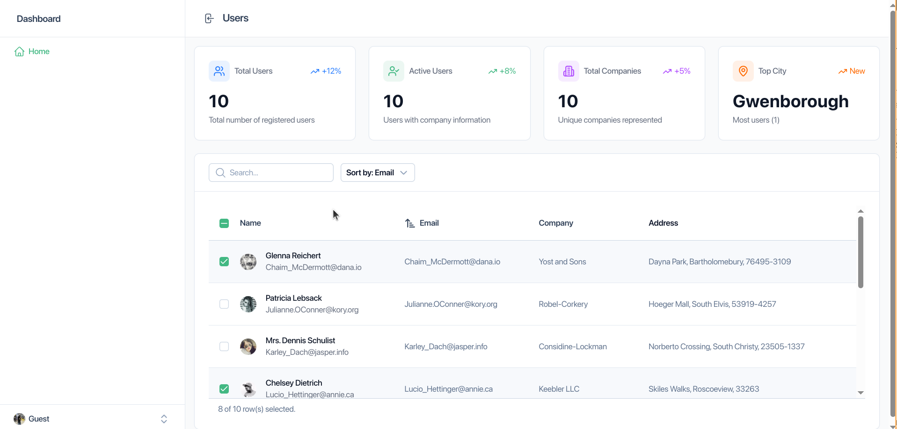
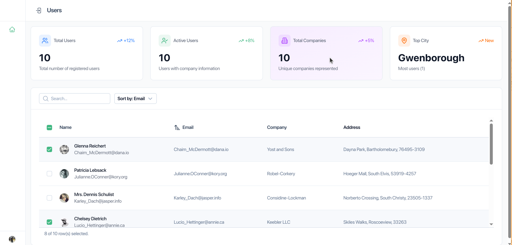
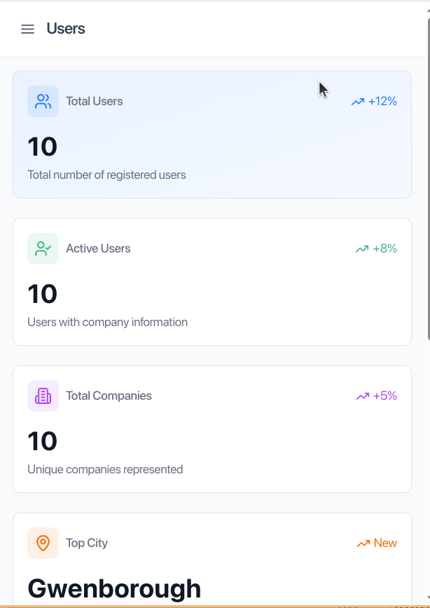

# User Dashboard

A modern, responsive user dashboard application built with Vue 3, Nuxt 3, and TypeScript. The application fetches and displays user data from JSONPlaceholder API with interactive filtering and sorting features.

## Preview

### Desktop View

*Main dashboard with statistics and user table*

### Sidebar Navigation

*Collapsible sidebar with navigation*

### Mobile View

*Responsive mobile interface*

## Features

- 📊 Interactive user statistics dashboard
- 🔍 Real-time search and filtering
- 📱 Responsive design with mobile support
- 🌓 Dark mode support
- 🔄 Dynamic data sorting
- 📈 User activity metrics
- 🏢 Company information tracking
- 📍 Geographic user distribution

## Tech Stack

- **Framework**: Vue 3
- **Language**: TypeScript
- **State Management**: Pinia
- **UI Components**: Nuxt UI
- **API Integration**: JSONPlaceholder
- **Authentication**: Clerk
- **Styling**: Tailwind CSS

## Project Structure

```
src/
├── assets/          # Static assets
├── components/      # Shared components
├── composables/     # Reusable Vue composables
├── features/        # Feature-based modules
│   └── user/        # User feature module
│       ├── components/    # User-specific components
│       ├── composables/   # User-specific composables
│       └── types/         # TypeScript types
├── layouts/         # Page layouts
├── lib/            # Utility functions and configurations
├── pages/          # Application pages
├── stores/         # Pinia stores
└── types/          # Global TypeScript types
```

## Key Components

### User Dashboard
- **StatsGrid**: Displays user statistics and metrics
- **UserTable**: Interactive table with sorting and filtering
- **DesktopSidebar**: Navigation for desktop view
- **MobileSidebar**: Responsive navigation for mobile
- **TopNavigation**: Header with search and controls

### State Management
- **useUserStore**: Manages user data and API interactions

## Performance Optimizations

1. **Lazy Loading**
   - Components are loaded on demand
   - Routes are code-split automatically

2. **Caching**
   - User data is cached in Pinia store
   - Computed properties for derived data

3. **Virtual Scrolling**
   - Table implements virtual scrolling for large datasets
   - Efficient rendering of large lists

4. **Debounced Search**
   - Search operations are debounced
   - Prevents excessive API calls

## Security Measures

1. **Authentication**
   - Clerk integration for secure authentication
   - Protected routes and API endpoints

2. **Data Validation**
   - TypeScript for type safety
   - Input validation and sanitization

3. **API Security**
   - CORS configuration
   - Rate limiting implementation

## Code Quality

1. **TypeScript Integration**
   - Strong typing throughout the application
   - Interface definitions for data structures

2. **Component Architecture**
   - Feature-based organization
   - Reusable composables
   - Single responsibility principle
   - State modular components

## Getting Started

1. **Installation**
   ```bash
   pnpm install
   ```

2. **Development**
   ```bash
   pnpm run dev
   ```

3. **Build**
   ```bash
   pnpm run build
   ```


## Environment Variables

```env
VITE_API_URL=https://jsonplaceholder.typicode.com
VITE_CLERK_PUBLISHABLE_KEY=pk_test_cHJvLXNlYXNuYWlsLTUxLmNsZXJrLmFjY291bnRzLmRldiQ
```

## Contributing

1. Fork the repository
2. Create your feature branch
3. Commit your changes
4. Push to the branch
5. Create a Pull Request

## License

MIT License - see LICENSE file for details
